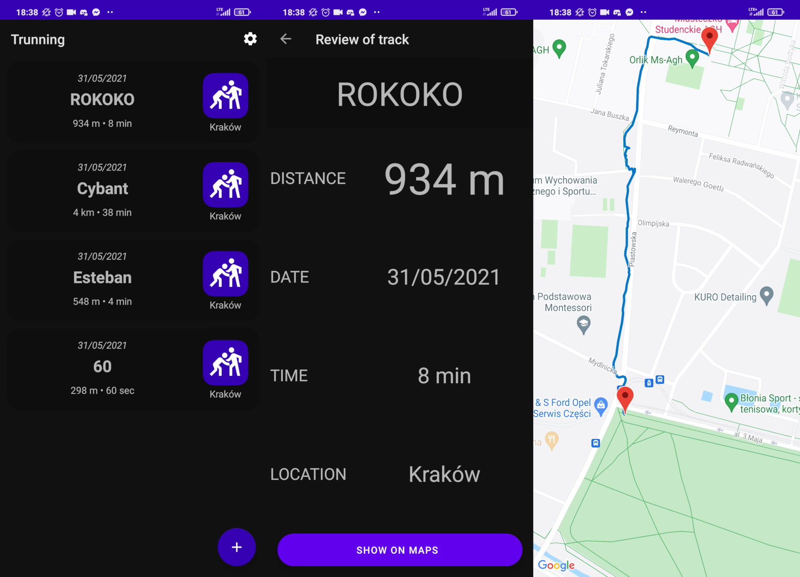
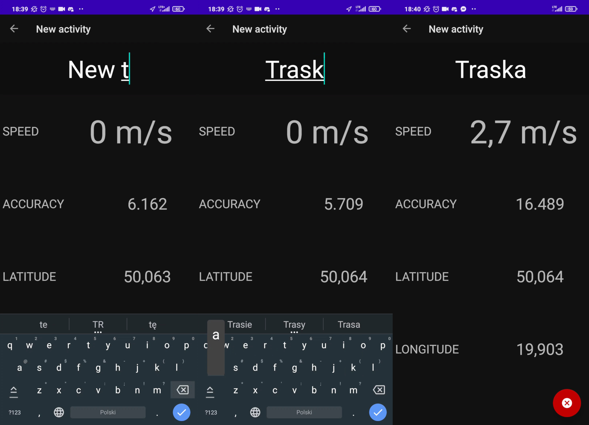

# Trunning = Training & Running

Application for tracking physical activity.

## Overview

With this app you are able to monitor your physical activity, track the paths you run on and visualise them on a map.

## Review your activity

The main screen displays the activities you have saved in the past. Clicking on any of the entries opens a preview screen so you can view details of your route. Clicking on "Show on maps" opens a map where you can see the route collected from your GPS data.

Maps are provided by Google.

## New activity

Clicking on the plus button will take you to the new activity screen. The screen continuously shows your speed, location accuracy and position. You can also set a new name for your route there.

## How to build app

To build the application you will need an API key for Google Maps. You can get it from the [Google Cloud Platform](https://console.cloud.google.com/).

## Usage & License

Trunning (apart from Google Maps) is free to use and fork under [BEER-WARE LICENSE](LICENSE).